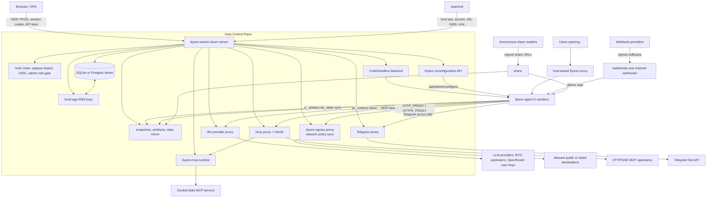
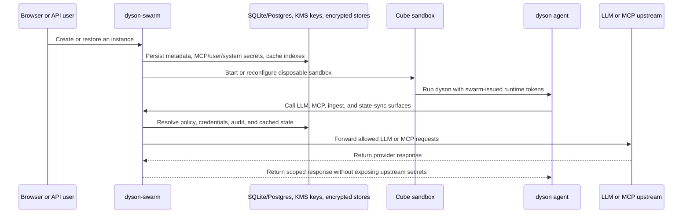

# dyson-swarm

The orchestrator side of the Dyson stack. `dyson-swarm` hires, restores,
rotates, snapshots, and reaps `dyson` agents running inside Cube
sandboxes; serves the operator/user web UI; and brokers outbound LLM and
MCP traffic through swarm-managed proxy surfaces.

The agent itself lives in the sibling [dyson](https://github.com/JonCooperWorks/dyson) repo. The two
repos ship independently, which is why swarm owns persistent state,
rotation, and upgrade orchestration.

## Architecture

## Workspace Layout

`dyson-swarm` is a Rust workspace with five intentionally coarse crates:

| Crate | Binary/library | Responsibility |
|---|---|---|
| `crates/core` | `dyson_swarm_core` | Shared domain logic: config, stores, instances, snapshots, secrets, webhooks, shares, state mirror, and network policy resolution |
| `crates/swarm` | `swarm`, `dyson_swarm` | Main HTTP server, auth middleware, `/llm/*`, `/mcp/*`, host-based dispatch, and embedded SPA |
| `crates/cli` | `swarmctl` | Host-operator commands that touch the DB or call the server API |
| `crates/egress-proxy` | `dyson-egress-proxy` | Policy-aware HTTP/HTTPS sandbox egress proxy |
| `crates/mcp-runtime` | `dyson-mcp-runtime` | Local Unix-socket helper for Docker/stdio and runtime-managed MCP transports |

## Documentation

Swarm now has a dedicated docs tree, mirroring the structure used in
`dyson`:

- [Documentation Index](docs/README.md)
- [Architecture Overview](docs/architecture-overview.md)
- [Configuration](docs/configuration.md)
- [Auth and Keys](docs/auth-and-keys.md)
- [Controllers and Channels](docs/controllers.md)
- [Artefacts](docs/artefacts.md)
- [Shares](docs/shares.md)
- [Audit](docs/audit.md)
- [LLM Proxy](docs/llm-proxy.md)
- [Restore and Clone](docs/restore-and-clone.md)
- [MCP and OAuth](docs/mcp-and-oauth.md)
- [Network Policies](docs/network-policies.md)
- [State Ownership](docs/state-ownership.md)
- [Storage and Secrets](docs/storage-and-secrets.md)
- [Database Backends](docs/database-backends.md)
- [HTTP and SPA](docs/http-and-spa.md)
- [Operations](docs/operations.md)
- [Testing](docs/testing.md)

## Notes

- `rotate_binary_on_startup` defaults to false. Keep it off for normal
  deploys; enable it only for a deliberate binary migration of live instances.
  See [Operations](docs/operations.md).
- Public share URLs use a signed capability token. The share `jti` is only an
  authenticated API row id; using it as `/v1/<token>` correctly returns 404.
  See [Shares](docs/shares.md).
- The host-side `swarmctl mint-api-key` flow is a break-glass tenant access
  path, not an admin-role override; see [Auth and Keys](docs/auth-and-keys.md).
